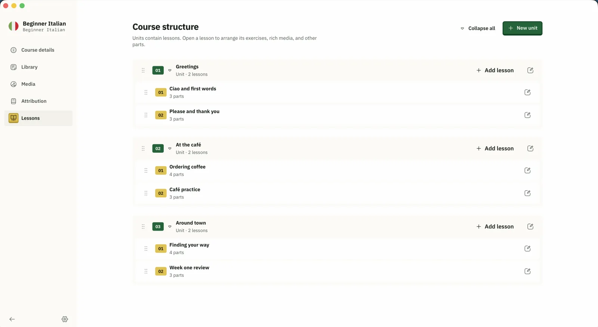
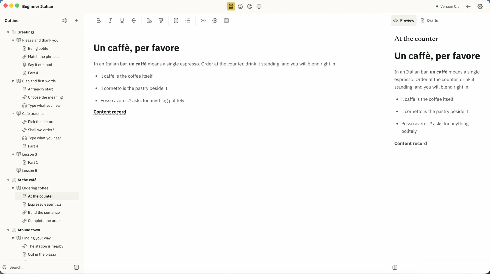
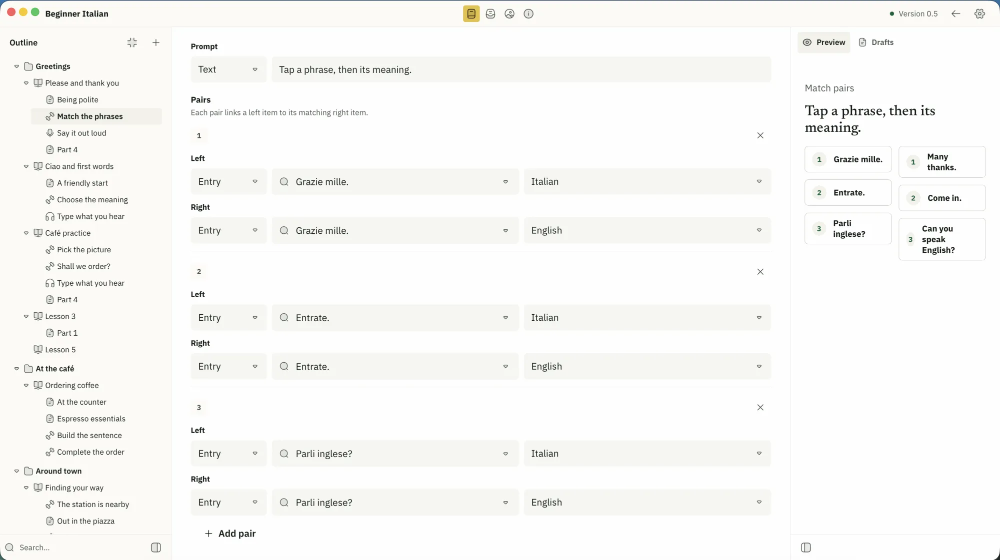
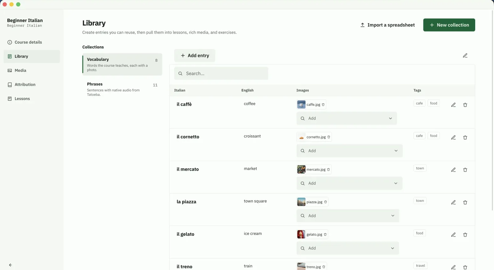
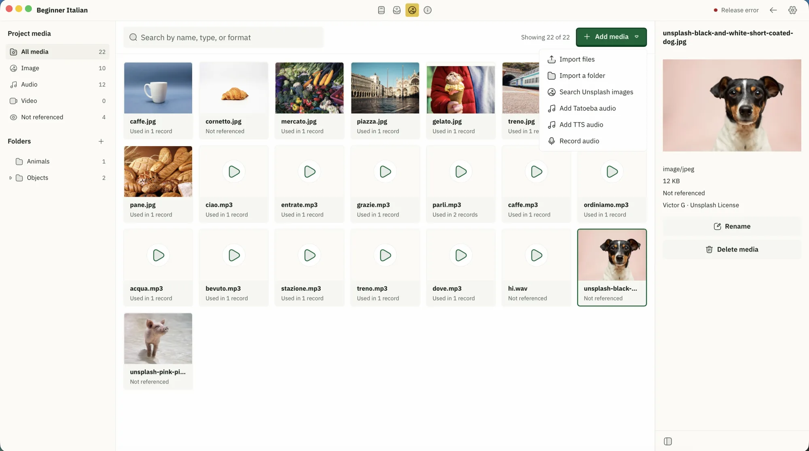

# Asakiri Studio

A local-first course editor for the desktop, built with React, TypeScript, Vite, and Tauri. The React frontend runs inside the Tauri desktop shell; local filesystem behavior is supplied by Tauri adapters kept behind ports.

## Screenshots

Structure the whole course. Group lessons into units and arrange each lesson's parts by dragging.



Write lessons with a live preview. A focused editor for rich text and references, with a learner preview beside every part.



Build exercises that check themselves. Multiple choice, listening, matching, word order, and more, each previewing as you edit.



Reuse content everywhere. Keep vocabulary and phrases in collections, then pull the same entries into any lesson, media block, or exercise.



Bring in real media. Search Unsplash photos and Tatoeba audio, record your own, or import files. Everything stays local to your project.



## Commands

```bash
pnpm tauri dev    # run the desktop app in development
pnpm dev          # Vite dev server for the frontend only
pnpm test         # feature tests in a jsdom environment
pnpm check        # boundaries, example data, TypeScript, tests, frontend build, and Rust
pnpm build        # type-check and build the frontend bundle
```

## Structure

```text
src/
├── app/          Composition root, providers, and global styles
├── core/         Stable product contracts shared across workflows
├── features/     Product slices with explicit public APIs
├── platform/     Tauri adapters
└── shared/       Product-agnostic components and utilities
```

See [docs/ARCHITECTURE.md](docs/ARCHITECTURE.md) before adding a feature, [docs/UI-SYSTEM.md](docs/UI-SYSTEM.md) before creating interface components, [docs/CONTENT-ARCHITECTURE.md](docs/CONTENT-ARCHITECTURE.md) before changing reusable content, media bindings, or exercises, and [docs/COURSE-FORMAT.md](docs/COURSE-FORMAT.md) before changing anything that is written to disk. Repository-wide agent rules are in [AGENTS.md](AGENTS.md).

To contribute, read [CONTRIBUTING.md](CONTRIBUTING.md), which covers setup, the `pnpm check`
gate, and where AI assistance stands. Participation is governed by
[CODE_OF_CONDUCT.md](CODE_OF_CONDUCT.md). To report a vulnerability, follow
[SECURITY.md](SECURITY.md) rather than opening an issue.

The on-disk course format is canonical at version 1 and specified in [docs/COURSE-FORMAT.md](docs/COURSE-FORMAT.md), with JSON Schemas in [schemas/asakiri-course/v1](schemas/asakiri-course/v1). A course is a directory of small JSON files, not a single `course.json`.

## License

The Asakiri Studio application is licensed under [MPL-2.0](LICENSE). The interoperability format schemas in [schemas/](schemas) are licensed separately under [Apache-2.0](schemas/LICENSE), so third-party editors, validators, and learner apps can depend on them without adopting the application's copyleft terms.

A validated reference course lives at [examples/courses/japanese-starter](examples/courses/japanese-starter). `pnpm check` validates it against both the parser and the published schemas.

## Localization

The interface is translated with [Lokalise](https://lokalise.com/), which provides its localization platform free of charge to open-source projects.

<a href="https://lokalise.com/"></a>
